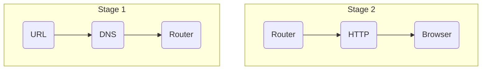

# First Step
The address that is typed into the browser's search bar.

This address is made up of:

|Protocol|Authority|Port|Route|Parameters|Fragment|
|:---:|:---:|:---:|:---:|:---:|:---:|
|https:|//user:password@links.com|:80|/modules/dwes|?id=123&search=php|#objects-111|

# Second Step
The address that we have entered is evaluated by the DNS server, which is in charge of looking for an IP that corresponds to the web page that is being searched for.

# Third Step
The router is responsible for requesting the information found on the Internet, to send it later to the computers that are requesting it.

# Fourth Step
The HTTP protocol to get that information from the web to transfer it to the user.

# Last Step
The page information reaches the router and the web page is displayed in the browser.

***

<!-- Mermaid Outline -->
