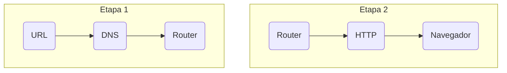

# Primer Paso
La dirección que se escribe en la barra de búsqueda del navegador.

Esta dirección está compuesta por:

|Protocolo|Autoridad|Puerto|Ruta|Parámetros|Fragmento|
|:---:|:---:|:---:|:---:|:---:|:---:|
|https:|//usuario:password@enlaces.com|:80|/modulos/dwes|?id=123&busqueda=php|#objetos-111|

# Segundo Paso
La dirección que hemos introducido es evaluada por el servidor DNS, el cual se encarga de buscar una IP que corresponda a la página web que se está buscando.

# Tercer Paso
El router se encarga de solicitar la información que se encuentra en Internet, para enviarla posteriormente a los equipos que la están pidiendo.

# Cuarto Paso
El protocolo HTTP de coger esa información de la web para transferirsela al usuario.

# Último Paso
La información de la página llega al router y se muestra la página web en el navegador.

***

<!-- Esquema Mermaid -->
